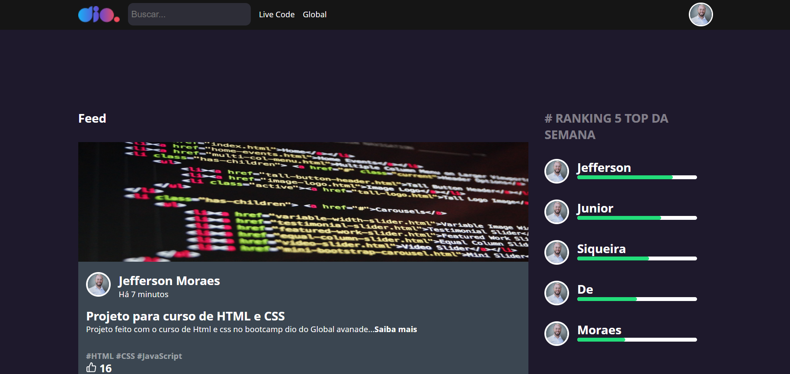

<h1 align="center"> - PageClone Dio - </h1>

Em caracter de estudo e aprimoramentos da máteria de React, elaboramos um exemplo de um site com o tema Dio Cursos.
 

  <a href="#-tecnologias">Tecnologias</a>&nbsp;&nbsp;&nbsp;|&nbsp;&nbsp;&nbsp;
  <a href="#-projeto">Projeto</a>&nbsp;&nbsp;&nbsp;|&nbsp;&nbsp;&nbsp;
  <a href="#-layout">Layout</a>&nbsp;&nbsp;&nbsp;|&nbsp;&nbsp;&nbsp;
  <a href="#memo-licença">Licença</a>

  

    
    
    

 

## 📱 Tecnologias

Esse projeto foi desenvolvido com as seguintes tecnologias:

- React
- Git e Github
- Vs Code

## 💻 Projeto

O Dio é um Site clone foi em caracter de estudo e aprimoramento da matéria de React.

## 🔖 Layout

Você pode visualizar o layout do projeto através [DESSE LINK](https://github.com/jeffersonmoraesjunior).

## :memo: Licença

Esse projeto está sob a licença MIT.

---

Feito com ♥ by Jefferson Moraes!
